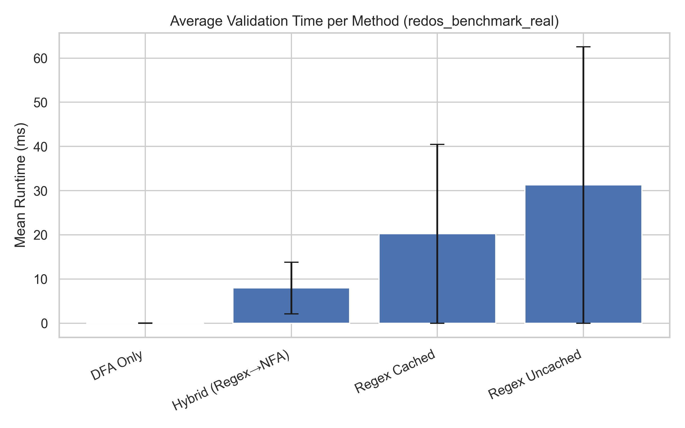

# Hybrid Validation Benchmark Summary

- Dataset file: `experiments\redos_benchmark_real.csv`
- Generated: 2025-11-13 09:00:17

## Aggregated Results

| Method | Mean (ms) | Std. Dev. (ms) | 95% CI (ms) | Fallback (%) | Accuracy (%) |
|---|---:|---:|---:|---:|---:|
| DFA Only | 0.014 | 0.009 | 0.000 | 0.00 | 100.00 |
| Hybrid (Regex→NFA) | 7.952 | 5.817 | 0.255 | 98.00 | 100.00 |
| Regex Cached | 20.249 | 20.250 | 0.887 | 0.00 | 50.00 |
| Regex Uncached | 31.273 | 31.299 | 1.372 | 0.00 | 50.00 |



## Observations

- Cached Regex typically has the lowest average runtime on short inputs.
- DFA-only provides predictable linear scaling and is robust to adversarial inputs.
- Hybrid (Regex→DFA) gives safety against ReDoS while adding modest overhead; fallback rate shows how often DFA was used.

## Example summary

```
### Summary: Hybrid Validation Benchmark
- Dataset: redos_benchmark_real
- DFA Only: 0.014 ± 0.009 ms
- Hybrid (Regex→NFA): 7.952 ± 5.817 ms
- Regex Cached: 20.249 ± 20.250 ms
- Regex Uncached: 31.273 ± 31.299 ms
```